# Pairing System Event-Driven Architecture Exercise

## Overview

This exercise builds a **Slack-based pairing system** where developers can join programming sessions and get automatically paired with teammates. The system demonstrates event-driven architecture patterns with multiple processors reading from shared queues and parallel processing workflows.

## System Architecture

```mermaid
graph TB
    A[Slack Channel] --> B[Command Parser]
    B --> C[Command Queue]

    %% Multiple processors reading from same Command Queue
    C --> D[Pairing Initiator]
    C --> H[Help Processor]
    C --> I[Status Processor]

    %% Team 1: Pairing Initiator
    D --> E[Paired Queue]

    %% Team 2: Help Processor
    H --> J[Help Queue]

    %% Team 3: Status Processor
    I --> K[Status Queue]

    %% Team 4: Paired Message Formatter
    E --> L[Paired Message Formatter]
    L --> M[Slack Message Queue]

    %% Help and Status push directly to Slack Message Queue
    J --> M
    K --> M

    %% Team 5: Slack Messenger
    M --> F[Slack Messenger]
    F --> G[Slack Channel]

    %% Sample Data Flow
    N["📩 Command Examples<br/>• @alice: 'join --no-pair @bob'<br/>• @charlie: 'command:pair'<br/>• @dave: 'help'<br/>• @eve: 'status'"] --> O["🎯 Pairing Data<br/>Team Alpha: alice + frank<br/>Team Beta: charlie + grace<br/>(raw pairing data)"]
    N --> P["💡 Help Message<br/>📚 Available commands:<br/>• join [--no-pair @user]<br/>• command:pair • help • status<br/>(formatted for Slack)"]
    N --> Q["📊 Status Message<br/>📈 Current Status:<br/>Active users: 6<br/>Waiting for pairing: Yes<br/>Last session: 2 hours ago<br/>(formatted for Slack)"]
    O --> R["🎯 Formatted Pairing<br/>🎯 Pairing Complete!<br/>Team Alpha: @alice + @frank<br/>Team Beta: @charlie + @grace<br/>(formatted for Slack)"]

    %% Styling
    classDef slackNode fill:#4A90E2,stroke:#2E5C8A,stroke-width:2px,color:#fff
    classDef processorNode fill:#27AE60,stroke:#1E8449,stroke-width:2px,color:#fff
    classDef queueNode fill:#F39C12,stroke:#D35400,stroke-width:2px,color:#fff
    classDef dataNode fill:#E8F4F8,stroke:#5DADE2,stroke-width:1px,color:#2C3E50

    class A,G slackNode
    class B,D,H,I,L,F processorNode
    class C,E,J,K,M queueNode
    class N,O,P,Q,R dataNode
```



## Team Assignments & Detailed Tasks

### **Team 0: Command Parser** 🔧

**Input**: Raw Slack Messages  
**Output Queue**: Command Queue

**Responsibilities**:

- Listen to Slack channel for all messages
- Parse and validate commands
- Standardize message format for downstream processors

**Detailed Actions**:

1. **Listen to Slack**: Monitor all messages in the #expansion-software-dev-club
2. **Filter Commands**: Only process messages that start with valid commands (`command:join`, `command:help`, `command:status`, `command:pair`)
3. **Parse User Data**: Extract user, and timestamp from Slack message
4. **Validate Commands (Stretch)**: Ensure commands are properly formatted
5. **Standardize Format (Stretch)**: Convert all valid commands to consistent JSON structure
6. **Publish to Queue**: Send standardized commands to Command Queue

**Sample Output** (Standardized Command):

```json
{
  "user": "alice",
  "command": "join",
  "timestamp": "2025-01-15T10:30:00Z"
}
```

---

### **Team 1: Pairing Initiator** 🎯

**Input Queue**: Command Queue  
**Output Queue**: Paired Queue

**Responsibilities**:

- Listen for `command:join` and `command:pair` commands
- Collect all users who want to participate (with today's date)
- Create optimal 2-person teams (3 if odd number) when `command:pair` is processed

**Detailed Actions**:

1. **Filter Commands**: Only process `command:join` and `command:pair` messages
2. **Collect Participants**: Maintain list of active users waiting for pairing
3. **Trigger Pairing**: When `command:pair` is received, start team creation
4. **Create Teams**: Generate optimal 2-person teams, create one 3-person team if odd number
5. **Publish Results**: Send raw pairing data to Paired Queue

**Sample Input** (from Command Queue):

```json
{
  "userId": "alice",
  "command": "join",
  "timestamp": "2025-01-15T10:30:00Z"
}
```

**Sample Output**:

```json
{
  "teams": [
    ["alice", "charlie"],
    ["dave", "eve"]
  ],
  "timestamp": "2025-01-15T10:35:00Z"
}
```

---

### **Team 2: Help Processor** 💡

**Input Queue**: Command Queue  
**Output Queue**: Slack Message Queue

**Responsibilities**:

- Listen for `help` commands
- Generate helpful documentation
- Format messages for Slack display

**Detailed Actions**:

1. **Filter Commands**: Only process `command:help` messages
2. **Generate Help Content**: Create command documentation with examples
3. **Format for Slack**: Add emojis, formatting, and clear structure
4. **Publish Formatted**: Send ready-to-send message to Slack Message Queue

**Sample Input** (from Command Queue):

```json
{
  "userId": "dave",
  "command": "help",
  "timestamp": "2025-01-15T10:30:00Z"
}
```

**Sample Output**:

```json
{
  "type": "help",
  "userId": "dave",
  "message": "📚 **Available Commands:**\n• `join` - Join the pairing session\n `command:pair` - Start the pairing process\n• `help` - Show this help message\n• `status` - Check current session status",
  "timestamp": "2025-01-15T10:30:01Z"
}
```

---

### **Team 3: Status Processor** 📊

**Input Queue**: Command Queue  
**Output Queue**: Slack Message Queue

**Responsibilities**:

- Listen for `command:status` and `command:join` commands
- Track current session state
- Report participation statistics

**Detailed Actions**:

1. **Filter Commands**: Process `status` and `join` messages
2. **Count Active Users**: Track how many people have joined
3. **Format Status Report**: Create readable status message with emojis and structure
4. **Publish Formatted**: Send ready-to-send message to Slack Message Queue

**Sample Input** (from Command Queue):

```json
{
  "userId": "eve",
  "command": "status",
  "timestamp": "2025-01-15T10:30:00Z"
}
```

**Sample Output**:

```json
{
  "type": "status",
  "message": "📈 **Current Status:**\n• Active users: 6\n• Use `command:pair` to start",
  "timestamp": "2025-01-15T10:30:01Z"
}
```

---

### **Team 4: Paired Message Formatter** 🎨

**Input Queue**: Paired Queue  
**Output Queue**: Slack Message Queue

**Responsibilities**:

- Format raw pairing data into engaging Slack messages
- Add team names, emojis, and mentions
- Create celebration-worthy announcements

**Detailed Actions**:

1. **Read Pairing Data**: Process raw team assignments from Paired Queue
2. **Generate Team Names**: Create fun team names (e.g., "Code Crusaders", "Debug Dragons")
3. **Format Mentions**: Ensure proper @user mentions for notifications
4. **Publish Formatted**: Send complete message to Slack Message Queue

**Sample Input**:

```json
{
  "teams": [
    ["alice", "charlie"],
    ["dave", "eve"]
  ],
  "timestamp": "2025-01-15T10:35:00Z"
}
```

**Sample Output**:

```json
{
  "type": "pairing",
  "message": "🎯 **Pairing Complete!**\n\n🚀 **Code Crusaders**: @alice + @charlie\n🔥 **Debug Dragons**: @dave + @eve\n\nHappy coding! 🎉",
  "timestamp": "2025-01-15T10:35:01Z"
}
```

---

### **Team 5: Slack Messenger** 💬

**Input Queue**: Slack Message Queue  
**Output**: Slack Channel

**Responsibilities**:

- Send all formatted messages to Slack

**Detailed Actions**:

1. **Read All Messages**: Process messages from Slack Message Queue regardless of type
2. **Send to Slack**: Use Slack API to post messages to the channel

**Sample Input**:

```json
{
  "type": "pairing",
  "message": "🎯 **Pairing Complete!**\n\n🚀 **Code Crusaders**: @alice + @charlie\n🔥 **Debug Dragons**: @dave + @eve\n\nHappy coding! 🎉",
  "timestamp": "2025-01-15T10:35:01Z"
}
```

**Action**: Posts the formatted message directly to Slack channel

---

## Supported Commands

| Command        | Description                  | Example        |
| -------------- | ---------------------------- | -------------- |
| `join`         | Join the pairing session     | `join`         |
| `command:pair` | Start the pairing process    | `command:pair` |
| `help`         | Show available commands      | `help`         |
| `status`       | Check current session status | `status`       |

Perfect! Now we have a complete **6-team architecture** that properly handles the entire flow:

## Key Learning Objectives

1. **Event-Driven Architecture**: Multiple processors reading from shared queues
2. **Parallel Processing**: Teams 1, 2, and 3 work simultaneously on different commands
3. **Data Transformation**: Raw data → processed data → formatted messages
4. **Separation of Concerns**: Business logic vs. message formatting vs. delivery
5. **Queue-Based Communication**: Loose coupling between system components

## Implementation Notes

- Use simple message queues (Redis, RabbitMQ, or even HTTP endpoints)
- Store minimal state (active users, preferences)
- Focus on message transformation and processing
- Each team can develop and test independently
- Integration happens through queue contracts

## Timeline

- **30 minutes**: Setup and architecture explanation
- **60 minutes**: Individual team implementation
- **45 minutes**: Attempt to run it together and debug what's failing

Good luck building your event-driven pairing system! 🚀
